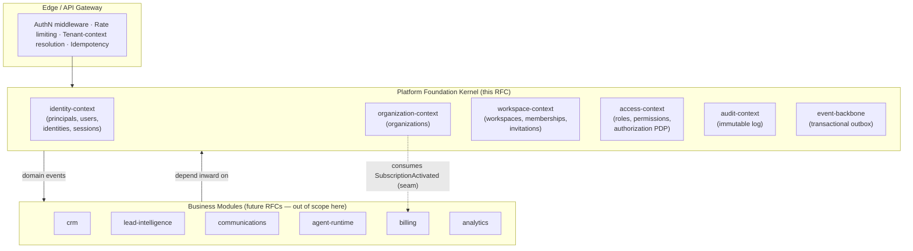

# RFC-001 — AgentOS Platform Foundation: Identity, Tenancy & Access Control Kernel

## Metadata

| Field | Value |
|---|---|
| RFC ID | ARCH-001 |
| Title | Platform Foundation — Identity, Tenancy & Access Control Kernel |
| Author | Principal Architect / CTO (acting) |
| Status | Draft → For Review |
| Scope | **One foundational layer only.** Depth over breadth. |
| Related RFCs | RFC-002 Event Backbone (future), RFC-003 Agent Runtime (future), DB-001 (embedded here) |
| Governing standards | `architecture-principles.md`, `security-standards.md`, `scalability-standards.md`, `naming-conventions.md` |
| Specialists coordinated | enterprise-architect, platform-architect, security-architect, database-architect, architecture-reviewer |

---

# 1. Executive Summary

**The foundational layer that must be built first is the Identity, Tenancy & Access Control Kernel — the platform control plane.** Not authentication. Not the CRM. Not the AI agents. The kernel that answers, on *every single request from any actor for the entire life of the platform*, three questions that no business feature can be built without:

1. **Who is acting?** (identity — a human *or* an AI agent *or* an automation)
2. **Inside which tenant boundary?** (organization → workspace)
3. **Are they permitted to do this, here, right now?** (authorization)

This is the single layer where a wrong decision is **unrecoverable**. Every other module — Lead Intelligence, CRM, Outreach, the Call Agent, Billing, Analytics, the future Marketplace — will store `organization_id` / `workspace_id` foreign keys on every row they ever write, will resolve permissions through this kernel on every call, and will attribute every action to a principal this kernel defines. If the tenancy model, the identity model, or the actor model is wrong, **you cannot migrate out of it without rewriting the foreign keys of the entire platform and re-attributing every audit record ever written.** Authentication can be swapped in an afternoon. The tenancy boundary cannot be swapped at all.

This RFC chooses that kernel, justifies it against the alternatives, **challenges three load-bearing assumptions in the project brief that would otherwise be baked irreversibly into this foundation**, and designs the kernel to the depth at which a senior team can begin implementation planning immediately: domain boundaries, folder structure, complete database schema, API contract, security architecture, event backbone, observability, and a scaling path from one user to ten million that **never changes the model — only the deployment topology.**

**Headline architectural decisions (defended in §15):**

- **Organization-first tenancy** — every user, including the solo freelancer, gets an auto-provisioned personal organization with one workspace. Solo and 100-person agency are *the same model at different cardinality*. This is the decision that prevents the most common fatal SaaS rewrite.
- **Actor (`principal`) supertype** — humans, AI agents, and automations are unified as first-class *principals* from day one. The platform is AI-native; agents act autonomously and must be authorized and audited identically to humans. Bolting this on later corrupts every audit trail.
- **Shared-schema row-level isolation (Postgres RLS), with a `pool → silo` escape hatch** for large enterprise tenants. The standard, defensible answer for "millions of small tenants + a few demanding enterprises."
- **UUIDv7 primary keys** (not UUIDv4) — global uniqueness and non-enumerability *without* destroying B-tree insert locality at scale.
- **Short-lived stateless access token + opaque, rotating, revocable refresh token** — reconciles the two hard requirements that pull in opposite directions: *stateless scale to 100M sessions* and *instant revocation*.
- **Transactional outbox event backbone in the kernel** — so every future module inherits reliable, tenant-stamped domain events for free.

**Major risk if we do nothing:** the brief's "build everything proprietary, assume millions from day one" framing, taken literally, produces a single-tenant-shaped, provider-locked, un-auditable foundation that has to be torn down at the exact moment enterprise revenue arrives. This RFC's purpose is to make the foundation *outlive* the product decisions stacked on top of it.

---

# 2. The Foundational Decision — Why This Layer, and Why First

The brief asks me to choose **exactly one** foundational building block and defend it. Here is the decision and the reasoning, including the alternatives I rejected.

## 2.1 The candidates

The brief lists plausible candidates: Core Platform Foundation, Authentication & Identity, User & Organization Management, Multi-Tenant Architecture, Platform Kernel, Access Control, Event Architecture, Service Layer, Developer Platform.

These collapse into **four real choices**, because several are the same thing under different names:

| Candidate | What it actually is | Verdict |
|---|---|---|
| Authentication system | Verifying credentials | **Too narrow.** Auth is a *generic domain* (commodity); it sits *on top of* identity, it isn't the foundation. |
| Event architecture | Async backbone | **Premature alone.** Events carry tenant + actor context; you cannot design the envelope before you've defined what a tenant and an actor *are*. |
| Service-layer / developer platform | API surface, SDKs | **Downstream.** An API is a projection of a domain that must already exist. |
| **Identity + Tenancy + Access, unified** | Who / where / allowed | **This is the foundation.** |

The AgentOS skill set agrees decisively: `modular-monolith-guidelines.md` names the *recommended first modules* as exactly `identity, workspace, organization, permissions, audit, event-bus`. `multi-tenancy.md` and `identity-access.md` both open with the words *"foundational platform capability."* The platform's own conventions point at this layer before any other.

## 2.2 Why these three concerns are one layer, not three

A frequent mistake is to build authentication first, organizations second, and permissions third, as separate efforts. They cannot be separated, because **authorization is the intersection of all three** and authorization runs on the hot path of every request:

```
Authorization decision = f( identity , tenant context , role/permission , resource ownership )
```

You cannot evaluate that function until all four inputs exist *and share one model*. The skill's own `identity-access.md` makes this explicit:

> Identity answers: *Who are you?* — Access answers: *What can you do?* — Authorization answers: *What are you allowed to do **right now within this tenant context**?*

Splitting these into independently-built systems guarantees an integration seam exactly where you can least afford one. So the foundational layer is the **kernel** that owns identity, tenancy, and access as a single, internally-bounded unit.

## 2.3 The irreversibility argument (the real reason it goes first)

The decisive test is not "what does everything depend on" — lots of things depend on logging. The decisive test is **"which decision, if wrong, cannot be undone?"**

- **A wrong tenancy boundary** means every row in the database has the wrong `organization_id`/`workspace_id` shape, or none. Retrofitting tenancy onto a live multi-million-row platform is the single most-cited cause of catastrophic SaaS re-platforming. You can never get a maintenance window long enough.
- **A wrong actor model** (humans-only, agents bolted on later) means every `created_by` and every audit record was written assuming a human, and you can never truthfully answer "did the AI or the person send this?" for historical data — fatal in an AI-native platform and in any enterprise security review.
- **A wrong identity model** (e.g., one user = one organization) means you cannot represent a freelancer who later forms an agency, or a consultant who belongs to three client workspaces, without a migration that breaks every foreign key pointing at "user."

Contrast with what *is* reversible and therefore should **not** go first: the password hashing algorithm (swap it on next login), the email provider, the payment gateway, the front-end framework, even the choice of message broker (if you hide it behind the outbox — see §12). **We invest maximal design effort precisely where rework is impossible, and deliberately defer the parts that are cheap to change.**

## 2.4 The decision

> **Build the Identity, Tenancy & Access Control Kernel first.** It is the only layer whose mistakes are permanent, the layer every other module references on every write and every request, and the layer the platform's own standards name as the foundation. Everything else in AgentOS is a *tenant of this kernel*.

---

# 3. Critical Review of the Project Brief

The CTO's job here is not to accept the brief — it is to find the assumptions that would, if encoded into this foundation, become permanent liabilities. Three are load-bearing and must be corrected *before* a line of schema is written. (Two more are downstream risks, flagged in §16.)

## 3.1 ❌ "Proprietary Everything / no third-party dependency" — internally contradictory and existentially risky

The brief states AgentOS will build the CRM, email infrastructure, call infrastructure, **and billing system** entirely in-house with "no dependency on third-party software." Two pages later it lists Razorpay, Stripe, and PayPal as payment integrations. **The brief contradicts itself**, and the contradiction matters because it reveals a category error.

There is a critical distinction the brief collapses:

- **Owning the *model and orchestration*** — the CRM data model, the outreach state machine, the AI brain, the identity/tenancy kernel. **Yes. Own these completely.** This is the moat.
- **Owning the *commodity infrastructure*** — payment rails (PCI-DSS, banking licenses), email-sending reputation (years of IP warming, deliverability ops), telephony carrier relationships, **and cryptographic authentication primitives**. **No.** Rebuilding these is not a moat; it is a multi-year tax that bankrupts the roadmap and *reduces* security.

The AgentOS skills already encode the correct stance: `ddd-guidelines.md` classifies **Authentication as a Generic Domain** with the instruction *"Do not over-engineer generic domains,"* and `security-standards.md` Principle 12 is blunt: **"Never implement custom cryptography."**

**Correction for this foundation:** the kernel **owns** the identity, tenancy, membership, role, and permission *model* (the irreversible part), and treats credential verification, OAuth, and future SSO as **provider-pluggable infrastructure behind an abstraction** (the reversible part). We never write our own password hashing or token crypto; we use vetted libraries (Argon2id) and standards (OIDC/SAML). This is not a compromise of the "ownership" value — it is the correct application of it.

## 3.2 ❌ "The Network Effect" vs. "complete tenant isolation" — a direct, unhandled collision

The brief promises both:

- *"As more users join, the AI learns from the aggregate patterns of millions of interactions across industries"* (the network-effect moat), **and**
- *"Data ... fully separated between workspaces. There is no possibility of data leakage or cross-contamination."* — reinforced by the skill's `multi-tenancy.md`: **"AI Memory Isolation is mandatory. Shared Global Memory: Incorrect."**

These cannot both be true unless the foundation provides a primitive that the brief never mentions: **per-tenant data-usage consent and classification, governed at the kernel.** Cross-tenant learning that is silent and ungoverned is simultaneously a GDPR / India-DPDP violation **and** the single fastest way to lose every enterprise deal in security review.

**Correction for this foundation:** the tenancy model must carry, from day one, a **data-governance dimension** — at minimum a per-organization `data_processing_consent` and a data-classification tag on tenant-owned data — so that any future cross-tenant aggregation is *opt-in, de-identified, and auditable by design*. tenant_id alone is not sufficient; the kernel must make "can this tenant's data contribute to platform-level learning?" a first-class, queryable, default-deny fact. (Modeled in §9; the cross-tenant *learning pipeline* itself is out of scope and belongs to a future AI-governance RFC.)

## 3.3 ❌ "Built for the solo freelancer" vs. "millions of businesses, multi-tenant" — the persona/model mismatch that kills SaaS

The brief's hero is *"a single talented developer working from a small town."* The skill's `multi-tenancy.md` correctly insists: **"AgentOS serves organizations. Not individual users."** If the foundation is shaped around the solo user (a flat `users` table that owns leads directly), then the day a freelancer hires their first contractor — or an agency signs up — you are retrofitting organizations, workspaces, and team permissions onto live data. This is the textbook fatal SaaS rewrite.

**Correction for this foundation (already in §1):** **organization-first, universally.** On signup, every user — solo or not — gets an auto-provisioned `organization` (their "personal" org) containing one `workspace`, with the user as `Owner`. The solo freelancer never *sees* this machinery (good product design hides it), but the *model* is identical to the enterprise. Scaling a freelancer into an agency becomes "invite a member," not "migrate the database." This single decision is why the foundation can serve the brief's hero on Tuesday and a 100-person agency on Wednesday with no schema change.

---

# 4. Architectural Goals

The kernel exists to deliver, permanently and for every module built on top of it:

1. **One identity, many contexts.** A person/agent exists once globally; access is granted per workspace. (Skill golden rule: *Identity is global, membership is contextual.*)
2. **Inviolable tenant isolation** enforced in depth — application, authorization, **and database** layers — so a bug in one layer cannot leak data across tenants.
3. **Authorization on the hot path, centralized and explainable** — default-deny, least-privilege, and every decision reconstructable for audit.
4. **First-class non-human actors** — AI agents and automations are principals with scoped permissions and full audit attribution, never bypass paths.
5. **A reliable, tenant-stamped event backbone** every future module can publish to and consume from without re-solving delivery guarantees.
6. **Provider-agnostic authentication** — email/OAuth today, enterprise SSO/SCIM tomorrow, with zero model change.
7. **Evolution without rewrite** — the same model serves 1 and 10,000,000 users; the same module extracts cleanly into a microservice when (and only when) evidence demands it.

---

# 5. Requirements

## 5.1 Functional Requirements

| ID | Requirement |
|---|---|
| FR-1 | Register a user via email+password or OAuth; link multiple identities to one user. |
| FR-2 | Auto-provision a personal organization + default workspace + Owner membership on first registration. |
| FR-3 | Authenticate and issue a session (access + refresh token pair). |
| FR-4 | Refresh, revoke, and list sessions; force-logout a device; revoke all sessions for a principal. |
| FR-5 | Create organizations and workspaces; nest a workspace under a parent (sub-account) up to a bounded depth. |
| FR-6 | Invite a user to a workspace by email with a pre-assigned role; accept/decline invitation. |
| FR-7 | Define system roles (templates) and organization-scoped custom roles; map roles → permissions. |
| FR-8 | Assign/revoke roles to a membership; resolve the effective permission set for `(principal, workspace)`. |
| FR-9 | Authorize an action: given `(principal, workspace, permission, resource)` → allow/deny, default-deny. |
| FR-10 | Create service accounts (for AI agents / automations / integrations) scoped to a workspace; issue/rotate/revoke API keys. |
| FR-11 | Record an immutable, tenant-stamped audit entry for every access-sensitive action. |
| FR-12 | Emit tenant-stamped domain events for every state change, delivered at-least-once via the outbox. |
| FR-13 | Carry per-organization data-processing consent and data classification (see §3.2). |

## 5.2 Non-Functional Requirements

**Scalability** — model unchanged across all four scale stages (`scalability-standards.md`): 10M+ users, 1M+ organizations, 10M+ workspaces, 100M+ sessions, billions of events. Authorization read-path is horizontally scalable and cache-backed; auth write-path is small; hot append-only tables are partition-ready.

**Reliability** — kernel availability target **99.95%** (it is on the critical path of *every* request, so it must be more available than any feature). Graceful degradation: if the permission cache is cold, fall back to the database; if the broker is down, events accumulate durably in the outbox and drain on recovery (no lost events). No single point of failure on the request path.

**Performance** — authorization decision **p99 < 10 ms** (cache hit), **< 50 ms** (cache miss / DB). Access-token validation is stateless (no DB round-trip). Login/refresh **p99 < 200 ms** (Argon2id is intentionally slow; this is a security feature, bounded by tuning).

**Security** — every principle in `security-standards.md` applies: default-deny, least-privilege, multi-tenant isolation, strong authN, layered authZ, immutable audit, encryption at rest/in transit, secrets in a vault, rate limiting at multiple layers, input validation, minimum-disclosure outputs. (Full design in §11.)

**Compliance readiness** — GDPR / India-DPDP / SOC 2 / ISO 27001 must be reachable *without redesign*: data classification, consent, right-to-erasure (soft-delete + crypto-shred path), immutable audit, data residency hook (`organization.home_region`).

## 5.3 Goal-specific targets (as the brief requests)

- **Scalability goals** — see §14. Net: *deployment topology* scales; *data model* is frozen.
- **Security goals** — zero cross-tenant leakage; 100% of access-sensitive actions audited; no credential ever stored reversibly or logged; agents can never exceed their granted scope.
- **Reliability goals** — no lost domain events (outbox guarantee); revocation effective within one access-token TTL (≤ 15 min) and *immediately* for refresh; tenant context can never be silently absent (a request with no resolved tenant is denied, not defaulted).
- **Extensibility goals** — add an auth provider, a role, a permission, a region, or a marketplace principal type with **no schema migration** to existing tables (JSONB `metadata`, catalog tables, and the principal supertype absorb the change).
- **Future-expansion considerations** — RBAC → ABAC, monolith → microservice, pool → silo, single-region → multi-region, internal → marketplace. All have pre-built seams (§17).

---

# 6. System Design

## 6.1 Where the kernel sits

AgentOS is a **modular monolith** (`modular-monolith-guidelines.md`, Principle 3). The Platform Foundation Kernel is the innermost ring; every business module is a consumer that depends *inward* on it and never the reverse.



**The rule that keeps this honest:** business modules talk to the kernel through *published contracts and events* (`ddd-guidelines.md` integration order: Domain Events → Published APIs → **never** direct DB access). No module reads the kernel's tables. The kernel never imports a business module. This is what makes future extraction a lift, not a rewrite.

## 6.2 Bounded contexts inside the kernel

Per `ddd-guidelines.md`, the kernel is internally divided into six bounded contexts, each owning its language, data, and events:

| Context | Owns (authoritative for) | Does **not** own | Key events produced |
|---|---|---|---|
| **identity** | `principals`, `users`, `identities`, `sessions` | tenancy, roles | `UserRegistered`, `IdentityLinked`, `SessionIssued`, `SessionRevoked` |
| **organization** | `organizations` (the legal tenant) | workspaces' internals, billing | `OrganizationCreated`, `OrganizationSuspended` |
| **workspace** | `workspaces`, `memberships`, `invitations` | identity, permission catalog | `WorkspaceCreated`, `MemberInvited`, `MemberJoined`, `MemberRemoved` |
| **access** | `roles`, `permissions`, `role_permissions`, `membership_roles`; the **Policy Decision Point** | who the user is, what the resource contains | `RoleAssigned`, `RoleRevoked`, `PermissionGranted` |
| **audit** | `audit_log_entries` (append-only) | anything mutable | — (terminal consumer) |
| **event-backbone** | `domain_events` (outbox) + relay | event *meaning* (producers own that) | — (transport) |

**Ubiquitous language** is fixed here for the whole platform (no synonyms — the skill forbids using *tenant/company/account/client* interchangeably): **Organization, Workspace, Member, Membership, Role, Permission, Principal, Service Account, Session.**

## 6.3 Internal layering (every module, including these contexts)

Per `modular-monolith-guidelines.md`, dependencies flow inward only:

```
interfaces/      ← REST controllers, event subscribers (driving adapters)
   ↓
application/     ← use cases / command + query handlers, orchestration
   ↓
domain/          ← entities, aggregates, value objects, domain services, domain events
   ↑
infrastructure/  ← repositories, provider adapters, persistence (driven adapters)
contracts/       ← published commands, queries, events other modules may consume
```

The **domain never depends on infrastructure**. Authentication providers, the database, and the broker are all driven adapters behind ports — which is precisely what makes them the *reversible* parts of §2.3.

## 6.4 Readiness seams (designed now, built later)

- **Microservice-ready** — each context already has `contracts/` and communicates via events; extraction = give it its own deployment + database, keep the contract. Migration phases in §17.
- **Event-driven-ready** — the outbox is in the kernel; the broker is abstracted, so "Postgres-relay today → Kafka tomorrow" changes one adapter, not producers (§12).
- **AI-agent-ready** — agents are `principals` with `service_accounts`; the PDP authorizes them identically to humans; audit attributes actions to the agent. The agent *runtime* is out of scope, but the *identity and authorization seam it will plug into* is fully specified.
- **Marketplace-ready** — a publisher org and a consumer org are two tenants; a future "installation" is a *cross-tenant grant* primitive (a consumer workspace grants a scoped, revocable, audited capability to a published agent) that is expressed in the same role/permission vocabulary and **never weakens isolation** (`multi-tenancy.md`). Seam noted; not built.

---

# 7. Folder Structure

Per `naming-conventions.md`: modules are business capabilities in `kebab-case`; **no `utils`, `common`, `helpers`, `shared`, `misc`** without explicit justification. "Shared" code is expressed as *named platform packages*, not a junk drawer.

```text
agentos/
├── apps/
│   └── api/                          # deployment unit (the monolith host)
│       ├── main.(ts|py)              # composition root: wires modules + adapters
│       └── http/                     # global middleware: authN, rate-limit, tenant-context, idempotency, error-handler
│
├── platform/                         # cross-cutting KERNEL primitives (justified "shared" — stable, domain-independent)
│   ├── tenant-context/               # the ambient TenantContext (org_id, workspace_id, principal) + propagation
│   ├── identifier/                   # UUIDv7 generation (single source of truth for IDs)
│   ├── persistence-kernel/           # base entity contract, soft-delete, optimistic-lock, RLS session-var setter
│   ├── result-and-errors/            # Result type + the canonical error taxonomy (Problem Details)
│   └── observability/                # structured logger, tracing, metric primitives (auto-inject tenant/correlation IDs)
│
├── modules/
│   ├── identity/
│   │   ├── domain/                   # Principal, User, Identity, Session aggregates; value objects (EmailAddress, PasswordHash)
│   │   ├── application/              # RegisterUser, AuthenticateUser, RefreshSession, RevokeSession use cases
│   │   ├── infrastructure/           # repositories; provider adapters: password/, oauth-google/, oauth-microsoft/, (future) saml/
│   │   ├── interfaces/               # /auth controllers; consumes SubscriptionActivated (plan cache)
│   │   ├── events/                   # UserRegistered, IdentityLinked, SessionIssued, SessionRevoked
│   │   └── contracts/                # published: AuthenticatePrincipal(query), PrincipalView
│   │
│   ├── organization/                 # ← same six-folder internal shape
│   ├── workspace/                    # workspaces, memberships, invitations
│   ├── access/                       # roles, permissions, role_permissions, membership_roles, + the PDP (authorization service)
│   ├── audit/                        # append-only writer + query side; consumes events from all contexts
│   └── event-backbone/               # outbox table, relay/publisher, broker port + in-process/kafka adapters
│
├── db/
│   ├── migrations/                   # forward-only, reviewed; one concern per migration
│   └── policies/                     # RLS policy definitions (versioned alongside schema)
│
└── contracts/                        # platform-wide published event schemas (versioned, the single registry)
```

**For each top-level area — purpose / responsibilities / ownership / scaling:**

| Folder | Purpose | Responsibilities | Ownership | Scaling consideration |
|---|---|---|---|---|
| `apps/api` | The deployment unit | Composition root; HTTP edge; wiring | Platform team | At Stage 4 this becomes *one of several* deployment units as modules extract; the composition root is where you "unplug" a module. |
| `platform/` | Irreducible kernel primitives | IDs, tenant context, persistence base, errors, observability | Platform team (highest bar for change) | These are imported everywhere, so they must stay tiny and stable. Most cross-module "shared" temptation belongs here *only if* it is truly domain-independent (`modular-monolith-guidelines.md`: "Most shared code is a sign of poor boundaries"). |
| `modules/identity` | Who is acting | AuthN, principals, sessions | Identity team (1 team owns 1+ modules) | Read-heavy at login spikes; auth providers are adapters → swap/add without core change. |
| `modules/organization` + `workspace` | Tenancy | Tenant hierarchy, membership, invitations | Tenancy team | Membership reads are the authZ hot path → cached; org/workspace counts are small relative to data rows. |
| `modules/access` | Authorization | Roles, permissions, PDP | Security/Platform team | The PDP is the most performance-sensitive component → see §14 caching. |
| `modules/audit` | Accountability | Immutable trail | Security team | Highest-volume write table → partitioned by time (§9.5). |
| `modules/event-backbone` | Reliable eventing | Outbox + relay + broker port | Platform team | Broker abstraction is the seam that lets Stage-1 Postgres-relay become Stage-3 Kafka. |
| `db/` | Schema + policies as code | Migrations, RLS | DBA + module owners jointly | Migrations are forward-only and tenant-isolation-aware; RLS policies are reviewed like security code. |
| `contracts/` | The integration boundary | Versioned event/command schemas | Cross-team, governed | This is how 100+ engineers avoid breaking each other: you depend on a *versioned contract*, never on another team's internals. |

**Why this scales from 1 → 100+ developers:** at 1 developer the structure is "more folders than I need today," which is the point — the boundaries are *free* now and *unbuyable* later. At 10–50, each team owns whole modules and integrates only through `contracts/` and events, so teams don't step on each other. At 100+, a module with proven load is lifted into its own service with its migration history intact, because it was never coupled to anyone's tables.

---

# 8. Data Flow

The canonical authorized write — *an AI agent moving a lead's pipeline stage* — exercises the entire kernel and shows the seams every module will use:

```mermaid
sequenceDiagram
    participant Client as Agent Runtime (service account)
    participant GW as API Gateway
    participant PDP as access (PDP)
    participant Mod as crm module (future)
    participant DB as Postgres (RLS)
    participant OBX as Outbox relay
    participant Bus as Broker

    Client->>GW: PATCH /workspaces/{wid}/leads/{id}  (Bearer access token / API key)
    GW->>GW: Validate token (stateless) → principal_id, active org/workspace, token_version
    GW->>GW: Resolve TenantContext (org_id, workspace_id) ; rate-limit ; idempotency-key
    GW->>PDP: authorize(principal, workspace, "lead.update", resourceRef)
    PDP->>PDP: effective permissions (cache → DB) ; default-deny ; ownership check
    PDP-->>GW: ALLOW
    GW->>Mod: command (TenantContext injected)
    Mod->>DB: BEGIN ; SET app.current_organization_id ; UPDATE leads ... (RLS enforces tenant) ; INSERT domain_events (outbox) ; COMMIT
    Note over Mod,DB: state change + event committed in ONE transaction
    Mod->>DB: (async) audit_log_entries INSERT (actor=agent principal)
    Mod-->>GW: 200 (or 409 on optimistic-lock version mismatch)
    OBX->>DB: poll unpublished events
    OBX->>Bus: publish LeadStageChanged (org/workspace/actor/correlation stamped)
    Bus-->>Mod: at-least-once delivery to subscribers (idempotent)
```

Three guarantees are visible and worth naming: (1) **the tenant boundary is enforced at the database**, not merely the app, so the agent *physically cannot* touch another tenant's row even if the app has a bug; (2) **the state change and its event are one atomic transaction** (outbox) — there is no window where the lead moved but the event was lost; (3) **the actor is the agent**, attributed truthfully in audit because agents are first-class principals.

---

# 9. Database Design

DB conventions per `schema-design.md` + `naming-conventions.md` (snake_case plural tables, `id` PK, `<entity>_id` FKs) and master DB rules (UUID PKs, audit fields, soft delete, version tracking, optimistic locking, tenant isolation).

## 9.1 The standard column contract (inherited by every tenant-owned table)

Defining this once is itself an architectural decision: it guarantees *every* table any future module ever creates is tenant-scoped, auditable, soft-deletable, and concurrency-safe by default.

| Column | Type | Purpose |
|---|---|---|
| `id` | `uuid` (UUIDv7) PK | Global, non-enumerable, **insert-ordered** identifier (§15.1). |
| `organization_id` | `uuid` NOT NULL → `organizations.id` | Tenant root. Leading column of composite indexes + RLS key. |
| `workspace_id` | `uuid` NULL/NOT NULL → `workspaces.id` | Operational boundary (NULL = org-scoped row). |
| `created_at` / `updated_at` | `timestamptz` NOT NULL | Audit timestamps. |
| `created_by` / `updated_by` | `uuid` NULL → `principals.id` | **Actor attribution — human or agent.** |
| `deleted_at` | `timestamptz` NULL | **Soft delete** (partial indexes exclude non-null). |
| `version` | `integer` NOT NULL DEFAULT 0 | **Optimistic lock** (write asserts expected version → 409 on mismatch). |
| `metadata` | `jsonb` NOT NULL DEFAULT `'{}'` | **Extensibility without migration** (GIN-indexed where queried). |

Platform-global tables (`users`, `identities`, `permissions`) omit `organization_id`/`workspace_id` (they are not tenant-owned) but keep `id`/timestamps/`deleted_at`/`version`.

## 9.2 Entity-relationship model

```mermaid
erDiagram
    PRINCIPALS ||--o| USERS : "is-a (human)"
    PRINCIPALS ||--o| SERVICE_ACCOUNTS : "is-a (non-human)"
    USERS ||--o{ IDENTITIES : "authenticates via"
    PRINCIPALS ||--o{ SESSIONS : "holds"
    ORGANIZATIONS ||--o{ WORKSPACES : "contains"
    WORKSPACES ||--o{ WORKSPACES : "parent-of (sub-account)"
    ORGANIZATIONS ||--o{ MEMBERSHIPS : "scopes"
    WORKSPACES ||--o{ MEMBERSHIPS : "scopes"
    PRINCIPALS ||--o{ MEMBERSHIPS : "granted via"
    MEMBERSHIPS ||--o{ MEMBERSHIP_ROLES : "has"
    ROLES ||--o{ MEMBERSHIP_ROLES : "assigned in"
    ROLES ||--o{ ROLE_PERMISSIONS : "grants"
    PERMISSIONS ||--o{ ROLE_PERMISSIONS : "granted by"
    ORGANIZATIONS ||--o{ ROLES : "owns (custom)"
    WORKSPACES ||--o{ INVITATIONS : "pending join"
    ROLES ||--o{ INVITATIONS : "pre-assigns"
    SERVICE_ACCOUNTS ||--o{ API_KEYS : "authenticates via"
    ORGANIZATIONS ||--o{ AUDIT_LOG_ENTRIES : "scopes"
    ORGANIZATIONS ||--o{ DOMAIN_EVENTS : "scopes"

    PRINCIPALS {
        uuid id PK
        text type "user | service_account"
        text status "active | suspended"
    }
    USERS {
        uuid id PK_FK "= principals.id"
        citext primary_email UK
        text display_name
    }
    SERVICE_ACCOUNTS {
        uuid id PK_FK "= principals.id"
        uuid organization_id FK
        uuid workspace_id FK
        text name
    }
    ORGANIZATIONS {
        uuid id PK
        citext slug UK
        text name
        text home_region
        text plan_tier_cache "event-synced from Billing"
        bool data_processing_consent "default-deny (§3.2)"
    }
    WORKSPACES {
        uuid id PK
        uuid organization_id FK
        uuid parent_workspace_id FK "nullable"
        citext slug
        text name
    }
    MEMBERSHIPS {
        uuid id PK
        uuid organization_id FK
        uuid workspace_id FK "null = org-level"
        uuid principal_id FK
        text status
    }
    ROLES {
        uuid id PK
        uuid organization_id FK "null = system role"
        text scope "organization | workspace"
        text name
        bool is_system
    }
    PERMISSIONS {
        uuid id PK
        text key UK "resource.action"
    }
```

## 9.3 Tables — purpose, why required, future use

For brevity I give purpose + why-required + the columns/constraints that matter beyond the standard contract.

1. **`principals`** — *the actor supertype.* **Why:** humans and AI agents must be authorized and audited identically; one root lets `created_by`, `sessions`, and `memberships` reference a single concept. **Future:** marketplace publisher principals, third-party integration principals — all slot in as `type` values with no schema change.

2. **`users`** — *a person* (specializes `principals`; PK = principal id). Cols: `primary_email` (CITEXT, unique where not deleted), `display_name`, locale/timezone in `metadata`. **Why:** global identity; one user, many orgs (skill Principle 1). **Future:** SSO/SCIM-provisioned users link here.

3. **`identities`** — *authentication credentials.* Cols: `user_id`, `provider` (`password|google|microsoft|…`), `provider_subject`, `secret_hash` (Argon2id, password only, never reversible), `last_authenticated_at`. Unique `(provider, provider_subject)`. **Why:** one user may sign in via several methods; decouples *who you are* from *how you prove it*. **Future:** add `saml`/`oidc` providers as rows, not migrations.

4. **`sessions`** — *authenticated context / refresh-token family.* Cols: `principal_id`, `refresh_token_hash` (unique), `family_id`, `device_label`, `ip`, `user_agent`, `issued_at`, `expires_at`, `revoked_at`, `last_used_at`. **Why:** sessions must be revocable, expirable, auditable (skill + security std). `family_id` enables refresh-reuse theft detection (§11.3). **Future:** device management UI, "log out everywhere," anomaly-based revocation.

5. **`organizations`** — *the legal tenant.* Cols beyond contract: `slug` (unique), `name`, `status` (`active|suspended|archived`), `home_region` (data-residency hook), `plan_tier_cache` (denormalized, event-synced from Billing — **not** authoritative), `data_processing_consent` (default `false`, §3.2). **Why:** owns subscription, workspaces, billing relationship; the tenant root every row references. **Future:** enterprise governance, region pinning, subsidiaries.

6. **`workspaces`** — *operational boundary inside an org.* Cols: `organization_id`, `parent_workspace_id` (nullable, **bounded depth** — see §15.5), `slug` (unique per org), `name`, `status`, white-label fields in `metadata`. **Why:** isolation inside an organization (agency's client-A vs client-B); the "sub-account" requirement. **Future:** departments, business units, agency-client white-label workspaces.

7. **`memberships`** — *a principal's relationship to a scope.* Cols: `organization_id`, `workspace_id` (NULL = org-level membership → enables Organization Owner/Admin/Billing-Manager; non-null = workspace-level), `principal_id`, `status` (`invited|active|suspended`), `invited_by`. Unique `(organization_id, workspace_id, principal_id)` where not deleted. **Why:** *membership grants access* (skill) — no implicit access. **Future:** the join object onto which any future per-scope attribute (department, region) hangs for ABAC.

8. **`roles`** — *a named permission set, contextual.* Cols: `organization_id` (NULL = system/template role), `scope` (`organization|workspace`), `name`, `is_system`. Unique `(organization_id, scope, name)` where not deleted. **Why:** roles are contextual, not global (skill Principle 4); orgs need custom roles (Sales/Support/Finance). **Future:** delegated administration, role inheritance.

9. **`permissions`** — *the capability catalog.* Cols: `key` (`resource.action`, unique), `resource`, `action`, `description`. **Why:** explicit, granular permissions (`lead.read`, `agent.execute`, `billing.manage`); avoid generic permissions (skill). **Future:** every new module ships its permission rows; the catalog is the contract between modules and the PDP.

10. **`role_permissions`** — role↔permission map. PK `(role_id, permission_id)`.

11. **`membership_roles`** — role assignment to a membership. PK `(membership_id, role_id)`. **Why:** a member can hold several roles; effective permissions = union (§11.4).

12. **`service_accounts`** — *non-human principals* (specializes `principals`). Cols: `organization_id`, `workspace_id`, `name`, `description`, `kind` (`agent|automation|integration`). **Why:** AI agents/automations need scoped, auditable identities that never bypass authZ (skill: *Agents inherit access from User OR Service Account Context*). **Future:** marketplace agents run as service accounts with capability-scoped grants.

13. **`api_keys`** — *service-account credentials.* Cols: `service_account_id`, `key_hash` (unique), `prefix` (for display/lookup), `expires_at`, `last_used_at`, `revoked_at`. **Why:** machine auth must be rotatable/revocable and never stored reversibly. **Future:** per-key scope narrowing, mTLS.

14. **`invitations`** — *pending workspace joins.* Cols: `organization_id`, `workspace_id`, `email`, `role_id` (pre-assigned), `token_hash` (unique), `status`, `expires_at`, `invited_by`. **Why:** team onboarding without pre-creating a user; ties into membership lifecycle. **Future:** bulk/domain-capture invites, SCIM auto-join.

15. **`audit_log_entries`** — *immutable accountability.* Cols: `organization_id`, `workspace_id`, `actor_principal_id`, `action`, `resource_type`, `resource_id`, `result` (`allow|deny|success|failure`), `ip`, `user_agent`, `correlation_id`, `metadata`, `created_at`. **Append-only** (no `updated_at`/`deleted_at`; INSERT-only grant). **Why:** every access-sensitive action must be traceable (skill + security std); enterprise/SOC 2 requirement. **Partitioned by `created_at` (monthly)** — §9.5. **Future:** hash-chaining for tamper-evidence; tiered retention 90d/1y/7y.

16. **`domain_events`** (outbox) — *reliable eventing.* Cols: `aggregate_type`, `aggregate_id`, `event_type`, `event_version`, `organization_id`, `workspace_id`, `actor_principal_id`, `correlation_id`, `causation_id`, `payload` (jsonb), `occurred_at`, `published_at` (NULL until relayed), `status`. **Why:** atomic state-change-plus-event (no lost events); the backbone every module publishes to. **Partitioned by `occurred_at` (monthly).** **Future:** event sourcing for selected aggregates; replay.

> **Deliberately *not* in this layer:** `subscriptions`, `invoices`, `payments`. They belong to the **Billing context** (`ddd-guidelines.md`: each datum has exactly one owner). The kernel only keeps `organizations.plan_tier_cache`, a read-model projection synced via the `SubscriptionActivated` event — a clean seam, not shared ownership. Tradeoff acknowledged in §15.

## 9.4 Multi-tenancy isolation model — the key DB decision

**Decision: shared database, shared schema, row-level isolation via Postgres Row-Level Security (RLS), with a documented `pool → silo` path for large enterprise tenants.**

Every tenant-owned table carries `organization_id`. An RLS policy enforces it at the database:

```sql
ALTER TABLE leads ENABLE ROW LEVEL SECURITY;
CREATE POLICY tenant_isolation ON leads
  USING (organization_id = current_setting('app.current_organization_id')::uuid);
```

The application sets `app.current_organization_id` once per transaction from the authenticated `TenantContext` (§6). **Defense in depth:** the app *intends* to filter by tenant; RLS *guarantees* it — a missing `WHERE organization_id = …` in any future query (across 100+ engineers) cannot leak data, because Postgres refuses to return other tenants' rows. A dedicated `platform_operator` role bypasses RLS for support tooling, and every such access is itself audited.

Why this over the alternatives (full analysis in §15.2): schema-per-tenant collapses under millions of schemas (catalog bloat); database-per-tenant is impossible at millions of small tenants but ideal for a few demanding enterprises — hence the **hybrid**: pool the millions of freelancers/SMBs cheaply in shared-schema RLS; *silo* the rare enterprise that contractually requires a dedicated database or region. The model (the `organization_id` everywhere) is **identical** in both modes, so a tenant migrates pool→silo without any schema change.

## 9.5 Indexing strategy

Principle (`indexing.md`): **lead every tenant-table composite index with `organization_id`** to enable partition pruning and make cross-tenant scans impossible; **partial indexes exclude soft-deleted rows.**

| Table | Key indexes |
|---|---|
| `users` | `UNIQUE (lower(primary_email)) WHERE deleted_at IS NULL` |
| `identities` | `UNIQUE (provider, provider_subject)`; `(user_id)` |
| `sessions` | `UNIQUE (refresh_token_hash)`; `(principal_id) WHERE revoked_at IS NULL`; `(family_id)`; `(expires_at)` for reaping |
| `workspaces` | `UNIQUE (organization_id, slug) WHERE deleted_at IS NULL`; `(organization_id)`; `(parent_workspace_id)` |
| `memberships` | `UNIQUE (organization_id, workspace_id, principal_id) WHERE deleted_at IS NULL`; `(principal_id)` ← **authZ hot path**; `(organization_id, workspace_id)` |
| `roles` | `UNIQUE (organization_id, scope, name) WHERE deleted_at IS NULL` |
| `permissions` | `UNIQUE (key)` |
| `api_keys` | `UNIQUE (key_hash)`; `(prefix)`; `(service_account_id)` |
| `invitations` | `UNIQUE (token_hash)`; `(organization_id, workspace_id)`; `(email)` |
| `audit_log_entries` | `(organization_id, created_at DESC)`; `(actor_principal_id, created_at DESC)`; `(resource_type, resource_id)` |
| `domain_events` | `(status, occurred_at) WHERE published_at IS NULL` ← **relay scan**; `(aggregate_type, aggregate_id)` |

`metadata` JSONB gets GIN indexes only on tables/paths actually queried (avoid over-indexing — write-amplification, per `indexing.md`).

## 9.6 Partitioning strategy

Per `partitioning.md`: **anticipate before necessary.** The two append-only, unbounded-growth tables are partition-ready from day one:

- **`audit_log_entries`** and **`domain_events`** — `PARTITION BY RANGE (created_at | occurred_at)`, monthly partitions (`audit_2026_06`, …), auto-created and auto-archived (move cold partitions to cheap storage, drop past retention). Queries are time-bounded → **partition pruning** keeps scans tiny.
- **Hot single-tenant skew** (one enterprise generating disproportionate events) — composite **hash-by-tenant sub-partitioning** is available without redesign; or that tenant goes *silo* (§9.4).
- Identity/tenancy tables (`users`, `organizations`, `workspaces`, `memberships`) are **not** partitioned initially — they are small relative to event/audit volume and the row counts (even 10M users) sit comfortably in a single well-indexed table; partition only on evidence.

## 9.7 Query patterns & scalability analysis

- **Read (hot):** "effective permissions for `(principal, workspace)`" — served from cache; on miss, a bounded join `memberships → membership_roles → role_permissions → permissions` (all PK/indexed). "validate access token" — **no DB** (stateless).
- **Write (small):** register/login/refresh, role assignment, invitation. Low volume; the heavy writes are audit + events, which are append-only and partitioned.
- **Reporting:** audit search by `(org, time)` / `(actor, time)` — index-served and partition-pruned; never run against the transactional hot path.

| Horizon | Users | Orgs | Audit+events rows | Strategy |
|---|---|---|---|---|
| Year 1 | ~100k | ~50k | ~10^8 | Single primary + 1 read replica; monthly partitions; cache permission sets. |
| Year 3 | ~1M | ~500k | ~10^10 | Read replicas for membership/permission reads; PgBouncer pooling; archive cold partitions; first enterprise *silos*. |
| Year 5 | ~10M | ~1M | ~10^11+ | Hash sub-partition hottest tables; identity module extractable to its own DB; multi-region via `home_region`. **Model unchanged.** |

---

# 10. API Architecture

Conventions per `naming-conventions.md`: `/api/v1/<resource>`, plural nouns, **no verbs in paths**, HTTP methods carry the action.

## 10.1 Versioning, naming, tenant context

- **Versioning:** URI-based `/api/v1/` (unambiguous, cache-friendly). Breaking changes → `/api/v2/` with `v1` deprecation window (Principle 14). Within a version, only additive changes.
- **Tenant context in the URL** for workspace-scoped resources — explicit and auditable: `/api/v1/workspaces/{workspace_id}/leads/{id}`. Org context is derived from the workspace server-side. Identity/session endpoints are not tenant-scoped (`/api/v1/auth/*`).
- **Resource naming examples:** `/api/v1/organizations`, `/api/v1/workspaces`, `/api/v1/workspaces/{id}/members`, `/api/v1/workspaces/{id}/roles`, `/api/v1/service-accounts`, `/api/v1/service-accounts/{id}/api-keys`.

## 10.2 Request standards

- **Pagination: cursor-based, never offset.** Offset pagination degrades and double-reads at scale (`scalability-standards.md` §16); cursors are stable and O(1). `?limit=50&cursor=<opaque>` → response carries `next_cursor`.
- **Filtering/sorting:** explicit allow-listed fields (`?status=active&sort=-created_at`); never unbounded `GET /records`.
- **Idempotency:** all unsafe methods accept an `Idempotency-Key` header; the gateway dedupes retries (critical once agents and automations are calling the API).
- **Validation:** every external input validated at the edge (`security-standards.md` §10); reject with a structured error, never partially apply.

## 10.3 Response & error standards

Success envelope (consistent, paginated where applicable):

```json
{
  "data": { "id": "0190c…", "name": "Acme Workspace", "version": 3 },
  "meta": { "request_id": "req_01J…", "next_cursor": null }
}
```

Errors follow **RFC 9457 Problem Details** (`application/problem+json`) — the modern standard, machine-readable and stable:

```json
{
  "type": "https://errors.agentos.dev/authorization/forbidden",
  "title": "Forbidden",
  "status": 403,
  "detail": "Principal lacks permission 'lead.update' in this workspace.",
  "instance": "/api/v1/workspaces/0190c.../leads/0190d...",
  "request_id": "req_01J...",
  "code": "AUTHZ_PERMISSION_DENIED"
}
```

Canonical taxonomy: `400` validation, `401` unauthenticated, `403` authorization (default-deny), `404` not-found *or tenant-mismatch* (we return 404 not 403 for cross-tenant resource references — never confirm existence of another tenant's resource → minimum disclosure, `security-standards.md` §11), `409` optimistic-lock/version conflict, `429` rate-limited.

## 10.4 Worked examples

```http
POST /api/v1/auth/register
{ "email": "dev@example.com", "password": "•••••", "display_name": "Solo Dev" }
→ 201  { "data": { "user_id": "…", "organization_id": "…", "workspace_id": "…" } }
# auto-provisions personal org + workspace + Owner membership (FR-2)

POST /api/v1/auth/sessions            # login
{ "email": "dev@example.com", "password": "•••••" }
→ 200  { "data": { "access_token": "<JWT, ~15m>", "refresh_token": "<opaque>", "expires_in": 900 } }

POST /api/v1/auth/sessions/refresh
{ "refresh_token": "<opaque>" }
→ 200  { "data": { "access_token": "…", "refresh_token": "<rotated>" } }   # rotation + reuse detection (§11.3)

POST /api/v1/workspaces/{wid}/invitations
Authorization: Bearer <JWT>
{ "email": "teammate@example.com", "role_id": "<workspace-member role>" }
→ 201  { "data": { "invitation_id": "…", "status": "pending", "expires_at": "…" } }

POST /api/v1/service-accounts
{ "workspace_id": "{wid}", "name": "outreach-agent", "kind": "agent" }
→ 201  { "data": { "principal_id": "…", "service_account_id": "…" } }   # the AI-agent identity seam
```

## 10.5 Rate limiting (multi-layer, per `security-standards.md` §16)

Three layers, each independently enforced: **per-IP** (anonymous/edge — brute-force, DDoS), **per-principal** (authenticated abuse), **per-organization** (noisy-neighbor protection + cost amplification control, *vital* once AI agents can drive request volume). Login endpoints get strict per-IP + per-account limits with exponential backoff.

---

# 11. Security Architecture

Every principle in `security-standards.md` is in scope; the highlights:

## 11.1 Authentication (provider-agnostic)

- **Password:** Argon2id hashing (memory-hard, tuned; **never custom crypto**). Stored in `identities.secret_hash`, never reversible, never logged.
- **Today:** email+password, magic link, Google/Microsoft OAuth — each an adapter behind an `IdentityProvider` port.
- **Tomorrow (no model change):** enterprise SSO via SAML/OIDC, SCIM provisioning, MFA (TOTP) — new adapters + an `identities.provider` value.
- **MFA-ready:** the session-issuance flow has an explicit "second-factor required" state from day one (`metadata`/status), so MFA is enabled, not architected, later.

## 11.2 Authorization (centralized PDP, layered enforcement, default-deny)

A single **Policy Decision Point** in the `access` module evaluates every decision against `(principal, workspace, permission, resource-ownership)` — **deny unless explicitly granted**. Enforced in depth (`security-standards.md` §6, never trust the UI): **API layer** (gateway checks coarse scope) → **service layer** (PDP checks the specific permission) → **database layer** (RLS guarantees tenant). Centralizing the PDP keeps decisions *consistent and explainable* (every allow/deny is audited with the inputs).

## 11.3 Session & token strategy (the reconciliation)

Two requirements pull oppositely: *stateless scale to 100M sessions* vs. *instant revocation*. The resolution:

- **Access token** — short-lived (~15 min) signed JWT, **stateless** (validated without a DB hit on the hot path). Carries *minimal* claims: `principal_id`, active `organization_id`/`workspace_id`, and a `token_version`. **It does NOT embed the permission set** — embedding permissions creates the stale-permission problem (revoke a role, the token still grants it until expiry). Permissions are resolved server-side (cached), so revocation is effective within one short TTL.
- **Refresh token** — opaque, high-entropy, **stored only as a hash** in `sessions`, **revocable immediately**. Rotated on every use; if a *already-rotated* refresh token is presented again, the entire `family_id` is revoked — automatic stolen-token detection.
- **Revocation:** logout / force-logout / "log out everywhere" all operate on `sessions`; bumping `token_version` invalidates outstanding access tokens at next validation.

## 11.4 Permission resolution pipeline

```
principal → memberships (for this workspace, status=active)
          → membership_roles → roles (+ inherited org-level roles)
          → role_permissions → permissions
          → effective set (UNION) → check requested permission → ownership check → ALLOW/DENY (default DENY)
```

Cached per `(principal, workspace)` in Redis; invalidated by `RoleAssigned`/`RoleRevoked`/`MemberRemoved` events (event-driven cache invalidation, §14).

## 11.5 AI agent & service-account authorization

Agents act as `service_account` principals (or under explicit delegated-user context) with **scoped** permissions — never a bypass. Every agent action is authorized by the same PDP and **audited with the agent as actor** (truthful "human vs. AI" attribution). This directly satisfies `security-standards.md` §21 (prompt-injection-driven privilege escalation is contained: a compromised prompt cannot grant the agent permissions it was never assigned).

## 11.6 Data protection, secrets, classification

- **Encryption** at rest (DB + backups) and in transit (TLS everywhere) — industry-standard algorithms only.
- **Secrets** (DB creds, provider keys, signing keys) in a managed vault — never in code, logs, or AI prompts (`security-standards.md` §13).
- **Data classification** (Public/Internal/Confidential/Restricted) + the **per-org `data_processing_consent`** flag (§3.2) make the network-effect feature *governable* and right-to-erasure tractable.

## 11.7 Audit & security boundaries

- **Immutable, append-only `audit_log_entries`**, tenant-stamped, for logins, permission changes, role assignments, key creation, agent executions, billing changes (§9.3). Tiered retention; hash-chaining available for tamper-evidence.
- **Trust zones:** public edge → authenticated app plane → data plane (RLS-isolated) → (future) agent sandbox. The tenant boundary is enforced in *both* the authorization layer and the database layer, so no single failure crosses it.

---

# 12. Event Architecture

Per `event-architecture.md` + `naming-conventions.md` (PastTense events; `domain.event` queues).

## 12.1 Transactional outbox (the reliability core)

State changes and their events are written **in one database transaction** to the `domain_events` table (§9.3). A separate **relay** polls unpublished rows and publishes to the broker, marking them published. This guarantees **no lost events** even if the broker is down (they accumulate durably and drain on recovery) and **no phantom events** (if the transaction rolls back, the event was never written). The relay marks-published idempotently; consumers are idempotent (dedupe on `event.id`).

## 12.2 Event envelope (every event, tenant-stamped)

```json
{
  "id": "evt_0190c…",            "type": "MemberJoined",   "version": 1,
  "occurred_at": "2026-06-15T…", "organization_id": "…",   "workspace_id": "…",
  "actor_principal_id": "…",     "correlation_id": "req_01J…", "causation_id": "evt_…",
  "payload": { "membership_id": "…", "principal_id": "…", "role_ids": ["…"] }
}
```

`organization_id`/`workspace_id` are **mandatory** (`multi-tenancy.md`: events without tenant context are prohibited); `correlation_id`/`causation_id` carry the trace across HTTP → event → job (§13).

## 12.3 Foundational event catalog

`UserRegistered`, `IdentityLinked`, `SessionIssued`, `SessionRevoked`, `OrganizationCreated`, `OrganizationSuspended`, `WorkspaceCreated`, `MemberInvited`, `MemberJoined`, `MemberRemoved`, `RoleAssigned`, `RoleRevoked`, `PermissionGranted`, `ServiceAccountCreated`, `ApiKeyRevoked`. **Consumed** (seam): `SubscriptionActivated`/`SubscriptionCancelled` → updates `organizations.plan_tier_cache`.

## 12.4 Broker abstraction (the reversible part)

Producers and consumers depend on a `MessageBus` port, never the broker SDK. **Stage 1:** the Postgres outbox + an in-process dispatcher is sufficient and operationally trivial. **Stage 3:** swap the adapter for Kafka/Pulsar (durable, partitioned, replayable) with **zero producer changes**. Reliability primitives specified now: at-least-once delivery, idempotent consumers, retry queues + **dead-letter queue** for poison messages.

---

# 13. Observability

Per `architecture-principles.md` §12 ("if it cannot be monitored, it is not production-ready"):

- **Structured logging** — JSON only; the `platform/observability` logger **auto-injects** `organization_id`, `workspace_id`, `principal_id`, and `correlation_id` from the ambient `TenantContext`, so every log line is tenant- and request-attributable. **Never log** passwords, secrets, or tokens (`security-standards.md` §15).
- **Distributed tracing** — OpenTelemetry; trace context propagates through HTTP **and across events** via `correlation_id`/`causation_id`, so an agent action → event → downstream job is one traceable chain.
- **Metrics** — RED (Rate/Errors/Duration) on the API and the PDP; auth success/failure rates; permission-cache hit ratio; outbox lag (unpublished-event age); session/token counts.
- **Audit** — distinct from operational logs: immutable, queryable, retained (§11.7). Logs answer "what is the system doing"; audit answers "who did what."
- **Alerting** — failed-login spikes, authorization-deny spikes, **cross-tenant access attempts** (RLS denials), refresh-token-reuse detections, outbox-lag thresholds, abnormal API-key usage (`audit-logging.md` alert integration).

---

# 14. Scaling Strategy

Per `scalability-standards.md`' four stages. **The thesis: the data model never changes; only the deployment topology does.** That is the entire payoff of getting this foundation right.

| Stage | Scale | What changes | What stays identical |
|---|---|---|---|
| **1** | 1–1,000 users | Single Postgres + app instance; in-process events; correctness focus. | Model, schema, contracts. |
| **2** | 1k–100k | Add read replica; Redis permission cache; PgBouncer; monthly partitions live. | Model, schema, contracts, APIs. |
| **3** | 100k–1M | Broker adapter → Kafka; horizontal app replicas (stateless); read replicas for membership/permission reads; archive cold audit/event partitions; first enterprise *silos*. | Model, schema, contracts, APIs. |
| **4** | 1M–10M+ | Extract `identity` to its own service + DB; hash-sub-partition hottest tables; multi-region via `home_region`; per-region read paths. | **Model, schema, contracts, APIs — unchanged.** |

**Bottlenecks specific to this layer + mitigations:**

1. **"Authorize every request" is the hottest path.** → Cache the resolved permission set per `(principal, workspace)` in Redis with **event-driven invalidation**; keep access tokens permission-free so revocation stays instant and tokens stay small. p99 < 10 ms on hit.
2. **Token validation under load.** → **Stateless** access tokens (signature check only) — the hot path never touches the DB; the refresh path (rare) does.
3. **100M+ sessions.** → Refresh-token families in a partitioned table (or Redis with durable backing); reaped by `expires_at`; access tokens stateless so session count doesn't load the read path.
4. **Audit/event write volume (the real growth).** → Append-only + monthly partitions + archival; never queried on the transactional path; the relay scans only `WHERE published_at IS NULL`.
5. **Tenant data growth + noisy neighbors.** → RLS + partition-ready; per-org rate limits; **pool→silo** for whales (no model change).
6. **Multi-region / residency.** → `organization.home_region` already on the tenant root; identity is global, tenant data is region-pinnable — the seam exists from day one.

---

# 15. Technical Decision Records

Each: **decision · alternatives · tradeoff · migration path · long-term impact.**

## 15.1 UUIDv7 primary keys
**Decision:** UUIDv7 (time-ordered) PKs everywhere. **Alternatives:** `bigserial` (smaller/faster but enumerable, leaks volume, hostile to sharding/multi-region merges); **UUIDv4** (random — globally unique but **destroys B-tree insert locality**, causing index fragmentation and write amplification at scale). **Tradeoff:** 16 bytes vs 8, and a slightly newer standard (RFC 9562) needing a current library — accepted for the locality + uniqueness + non-enumerability combination. **Migration:** none needed; if a library gap appears, generate v7 in `platform/identifier` (single source). **Long-term:** healthy index performance at 10^11 rows; safe cross-region ID generation without coordination.

## 15.2 Shared-schema RLS, with pool→silo
**Decision:** §9.4. **Alternatives:** schema-per-tenant (catalog bloat at millions; migration nightmare across N schemas); DB-per-tenant (gold-standard isolation, **impossible** at millions of small tenants, ideal for a few enterprises). **Tradeoff:** shared-schema has *softer* hard-isolation than DB-per-tenant and a noisy-neighbor risk — mitigated by RLS (defense-in-depth), per-org rate limits, and the silo escape hatch. **Migration:** pool→silo moves a tenant's rows to a dedicated DB/region with **zero schema change** (same `organization_id`). **Long-term:** serves millions cheaply *and* satisfies the enterprise that demands physical isolation — without forking the codebase.

## 15.3 Modular monolith first
**Decision:** one deployment, hard module boundaries (`modular-monolith-guidelines.md`). **Alternatives:** microservices now (premature: distributed transactions, service discovery, ops overhead with no business value yet); big-ball-of-mud monolith (fast then fatal). **Tradeoff:** requires *discipline* — boundaries are enforced by convention/contracts, not network walls; a sloppy team can violate them. Mitigated by the `contracts/`-only integration rule and review gates. **Migration:** the four-phase extraction (internal module → independent deploy → independent DB → service) per §17. **Long-term:** ship fast now, extract on *evidence* later, never rewrite.

## 15.4 Stateless access + opaque revocable refresh
**Decision:** §11.3. **Alternatives:** pure-stateless JWT (can't revoke before expiry — unacceptable for security); pure-stateful sessions (DB hit on *every* request — won't scale to 100M). **Tradeoff:** two token types + rotation logic is more complex than one — accepted because it's the only design that satisfies *both* hard requirements. **Migration:** none. **Long-term:** instant revocation + stateless hot path simultaneously, at any scale.

## 15.5 Bounded sub-account depth (not arbitrary recursion)
**Decision:** `workspaces.parent_workspace_id` allows nesting, but enforce a **bounded depth** (e.g., 2–3 levels: org → workspace → sub-workspace). **Alternatives:** flat (no sub-accounts — fails the agency/department requirement); unlimited recursion (unbounded recursive authZ resolution → performance cliffs and reasoning complexity). **Tradeoff:** a hard depth limit is slightly less "flexible" than infinite nesting — accepted because unbounded hierarchy makes permission resolution and UX unpredictable at scale; almost no real org needs >3 levels. **Migration:** raise the limit later if evidence demands (it's a check, not a schema constraint). **Long-term:** predictable authZ performance; covers departments/business-units/white-label-client workspaces.

## 15.6 Principal supertype for actors
**Decision:** unify humans + agents + automations under `principals` (§9.1). **Alternatives:** `users`-only with agents bolted on later (corrupts `created_by`/audit historically — irreversible); polymorphic `actor_type + actor_id` columns everywhere (no referential integrity, error-prone). **Tradeoff:** one extra join (`principals → users`/`service_accounts`) — trivially cheap, PK-indexed. **Migration:** none if done now; *impossible* to do cleanly later — which is exactly why it's a foundational decision. **Long-term:** truthful "human vs. AI" attribution forever; marketplace/integration principals slot in free.

## 15.7 Provider-pluggable authentication (corrects §3.1)
**Decision:** `IdentityProvider` port; vetted libraries/standards behind it; never custom crypto. **Alternatives:** "proprietary everything" auth (per the brief — slower, *less* secure, no enterprise SSO). **Tradeoff:** a dependency on external standards/libraries — exactly the right dependency to have. **Migration:** add adapters (SAML/OIDC/SCIM) with no model change. **Long-term:** enterprise-SSO-ready the day the first enterprise asks, with no re-architecture.

---

# 16. Risks

| # | Risk | Impact | Mitigation |
|---|---|---|---|
| R-1 | Modular-monolith boundaries erode under delivery pressure (team writes cross-module DB reads). | Loses future extractability → the thing this RFC exists to prevent. | `contracts/`-only integration rule; CI dependency-lint forbidding cross-module imports; architecture review gate (`architecture-review.md`). |
| R-2 | RLS misconfiguration or a forgotten policy on a new table leaks tenant data. | Catastrophic (the one unforgivable failure). | RLS-by-default migration template; CI test asserting RLS enabled on every tenant-owned table; cross-tenant access alerting (§13). |
| R-3 | Network-effect feature ships before consent/classification governance (§3.2). | GDPR/DPDP violation; enterprise-deal-killer. | Consent default-deny in schema *now*; cross-tenant learning blocked at the kernel until a dedicated AI-governance RFC. |
| R-4 | Permission-cache staleness after revocation. | Over-broad access for a window. | Event-driven invalidation on Role/Member changes; short TTL fallback; `token_version` bump. |
| R-5 | **Downstream:** WhatsApp/LinkedIn/Instagram ToS + India TRAI/DND + "AI-indistinguishable-from-human" calling-disclosure laws. | Channel bans; legal exposure (not this layer's bug, but it inherits the blast radius). | Out of scope here, **but** the kernel pre-bakes the primitives downstream compliance needs: immutable audit, per-channel identity (service accounts), and the consent ledger. Flag for a Communications/Compliance RFC. |
| R-6 | "Provision for millions on day one" → cost burn before revenue. | Runway risk. | Design for 10M (done), **deploy for Stage 1** (`scalability-standards.md`: Stage 1 = correctness, not horizontal scaling). |

---

# 17. Future Evolution & Migration Paths

- **Monolith → microservice (per module):** Phase 1 internal module → Phase 2 independent deployment (same DB) → Phase 3 independent database → Phase 4 independent service. The `identity` module is the likely first extraction (its load profile and security isolation justify it earliest); it already has `contracts/` + events, so extraction is a lift.
- **RBAC → ABAC:** add a policy/condition layer (e.g., OPA/Cedar-style) keyed on attributes already present (`organization.home_region`, `plan_tier`, membership department in `metadata`, resource ownership). RBAC becomes the base case of ABAC — **no rewrite**, per `security-standards.md` §8 and `identity-access.md`.
- **Pool → silo:** runbook to migrate an enterprise tenant to a dedicated DB/region; identical schema, so it's data movement, not redesign.
- **Enterprise identity:** SSO (SAML/OIDC) + SCIM provisioning as new `identities.provider` values + adapters.
- **Marketplace:** publisher org → published agent → consumer org expressed as a **cross-tenant capability grant** in the existing role/permission vocabulary — scoped, revocable, audited, **isolation never weakened** (`multi-tenancy.md`).
- **Multi-region:** `home_region` on the tenant root → region-pinned tenant data with global identity.

---

# 18. Architecture Review Findings

Per `architecture-review.md` and `quality-gates.md`.

## 18.1 Scorecard

| Dimension | Score (1–5) | Notes |
|---|---|---|
| Simplicity | 4 | Modular monolith + one DB is operationally simple; the principal supertype and dual-token add justified, contained complexity. |
| Scalability | 5 | Model frozen across all four stages; hot path cache-backed + stateless; partition- and silo-ready. |
| Security | 5 | Default-deny, layered enforcement, RLS defense-in-depth, immutable audit, first-class agent authZ, no custom crypto. |
| Cost | 4 | Shared-schema pooling is cheap at scale; consent/governance avoids the costliest failure (enterprise loss / regulatory fines). |
| Reliability | 5 | Outbox guarantees no lost events; graceful degradation on cache/broker failure; 99.95% target on the critical path. |
| Maintainability | 4 | Strong boundaries + contracts; depends on review discipline (R-1) to stay at 4+. |

## 18.2 Quality gates

Scalability ✅ · Security ✅ · Maintainability ✅ · Extensibility ✅ · Performance ✅ · Cost-efficiency ✅ · Operational complexity ✅ (low for the value delivered).

## 18.3 Outcome

> **APPROVED WITH CONDITIONS.** The kernel design is sound and conformant to AgentOS standards. Approval is conditioned on three corrections being treated as **non-negotiable, built into v1**, not deferred: (1) **provider-pluggable authentication** — abandon "proprietary auth" (§3.1/§15.7); (2) **per-tenant consent + data classification** in the schema from day one (§3.2/R-3); (3) **organization-first model universally**, including solo users (§3.3). These are the irreversible decisions; everything else can evolve.

---

# 19. What This Unlocks (and the next RFC)

With this kernel in place, **every** subsequent module is a tenant of it and inherits — for free — tenant isolation, identity, authorization, audit, and reliable events. The recommended next foundational RFC is **RFC-002: Event Backbone Hardening** (broker selection + consumer framework) *or* **RFC-003: Agent Runtime**, which plugs directly into the `service_account` principal and PDP seams specified here. Per the brief's instruction — **we do not proceed to those until this foundation is reviewed and ratified.** Depth over breadth; the foundation first.

*— End of RFC-001.*
